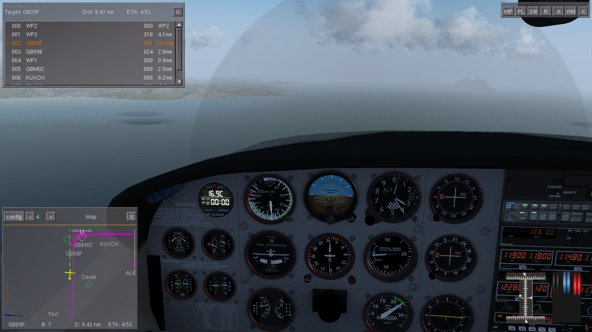
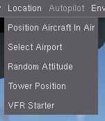
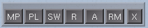
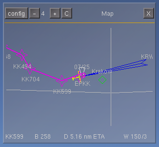
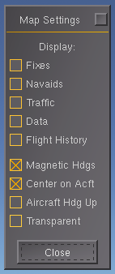
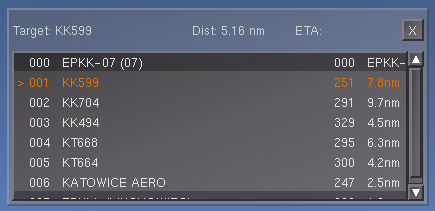

This is FlightGear VFR flight helper add-on. It helps with VFR flights by
offering simplified map, route manager interface and helpers to get quickly to
most common settings.

Normally I use it after planning the route in the external route planners (e.g.
LittleNavMap or VfrFlight). Then export the data in gpx/fgfs format and import
it on the start or during the simulation in the route manager window. Then it
is used for navigation helper and to check how the planned route is performing.

# Add-on usage

Addon creates quickaccess toolbar to access most used functions during the VFR
flight. When enabled and configured the add-on places several additional windows
on top of the simulator window. From it you can track current progress with the
route, which can be imported with the Qt Launcher interface or via the route
manager interface in the simulator.

On this window, add-on places two windows - smallmap with additional route
information and route plan.

**TIP:** After importing flight plan do not forget to activate it in the route manager
window. Without it, Flightgear won't be able to automatically switch between
waypoints.

**NOTE:** At the Overview window in the right lower corner, there is a control
visualization from FGCamera addon (I mostly fly with the double mouse configuration
and it is handy to see current yoke position when using mouse control)

# General interface

Addon creates it's `VFR Starter` menu in the Add-On main menu (the last menu in
the interface). If you can't see the main menu try pressing `F10` to reveal hidden
menu.

When selecting `VFR Starter` from the menu, the quick view appears. It is a launcher
to most common used items needed for the flight.

* **MP** - Small Map - shows small map in the lower left corner.
* **PL** - Flight Plan - displays flight plan route with information about current route leg
* **SW** - Stopwatch - shows default stopwatch
* **R** - Radio interface - shows default radio interface
* **A** - ATC in range - displays ATC Stations in current aircraft range
* **RM** - Route Manager - displays Route Manager interface
* **X** - closes the quick access menu

Addon remembers the state of the quick access menu. When you close the simulator
with the quick start open, it opens on the next start.

# Small map

Small map is a variation of the normal map available in the main menu (Equipment -> Map).
It does not contain setting on the same screen, but has additional information
about current route leg and environment. It can be resized to smaller area than
normal map especially useful for lower resolution screens during the simulation.

**INFO:** This map shares its settings with the main map, so setting visibility in one
view affects the other.

On the top of the map the buttons have following meaning:

* **CONFIG** - access to the map configuration window
* **-/+** - zoom in/out of the current map view
* **C** - center view on the aircraft
* **X** - close the map window

Below the map there are several labels with the information lined in the
following order:

**Waypoint | Bearing | Distance | ETA | Wind DIRECTION/STRENGTH**

* **Waypoint** - current active waypoint
* **Bearing** - bearing from current position the current waypoint
* **Distance** - distance (in nm) to the current waypoint
* **ETA** - Estimated Time of Arrival to the current waypoint
* **Wind Direction/Strength** - current wind situation (120/13 -> wind from direction 120 with speed 13 knots)

After clicking `CONFIG` the standard configuration for the map view appears, 
in which you can configure visibility and window behaviour.

# Flightplan

After clicking `PL` on the main quick access menu, the flightplan window appears.
It is a window with the current loaded flightplan list (via the `Route Manager`).

On the top line, there is a place for information about: Current waypoint name,
distance and ETA to this waypoint. If the time is not possible to calculate, the
place is empty.

# Stopwatch/Radio Interface/ATC in Range/Route Manager

These are standard instruments/devices/windows available in the flightgear
simulator. It is only a quick access window to this data.

# Support/Development

Look on the github page https://github.com/slawekmikula/fg-addon-vfrnavigator.
Post there issues, requests for new features and by all means fork it, modify and
provide pull requests :)

Have fun.